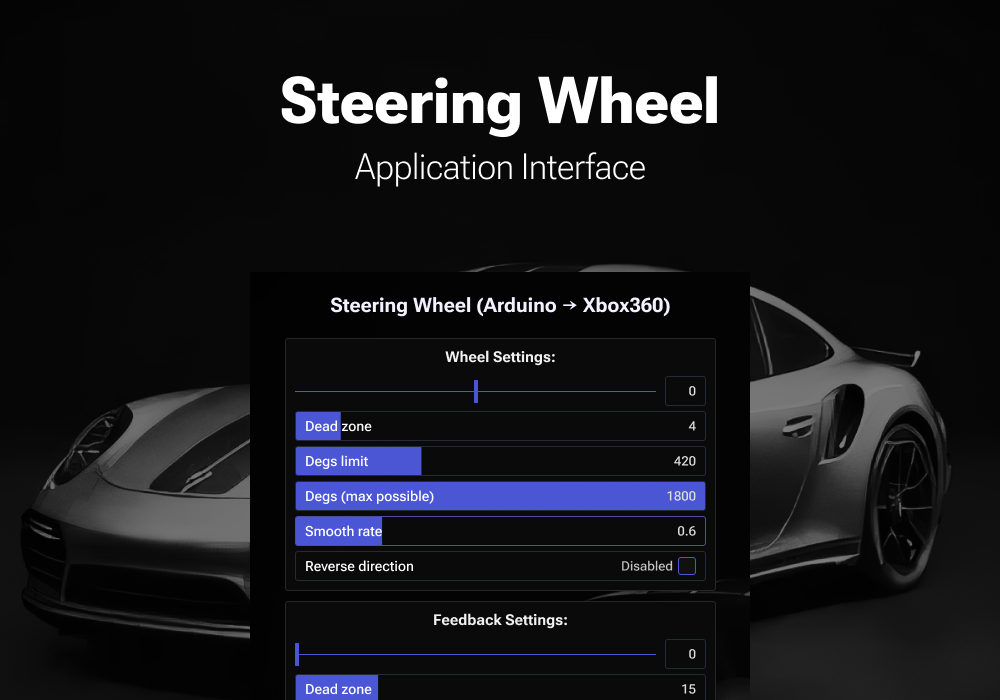
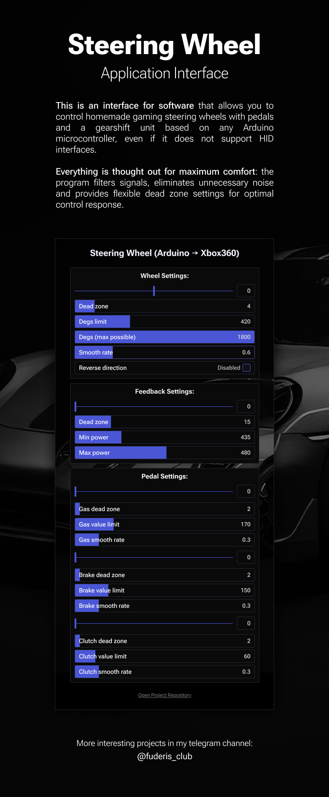

# Steering Wheel (Arduino -> Xbox360)

**This is software** that allows you to control homemade game steering wheel with pedals and gearshift based on any Arduino microcontroller, even if it does not support HID interfaces. 

**Everything is thought out for maximum comfort**: the program filters signals, eliminates unnecessary noise and provides flexible adjustment of the dead zone for optimal response to control.

> **Download for Windows**: [Release v1.0.2](https://github.com/fuderis/steering-wheel/raw/main/SteeringWheel.zip)

## How does it work?

* **The firmware on the board**: simply **transmits the potentiometers and button data to the computer via the COM port**, and also **receives commands to control the force feedback motor**.
* **The software**: reads data from the COM port and **emulates a virtual Xbox 360 gamepad**, which is **fully supported by most games**. All of this runs at incredible speed, as it’s **written in the high-performance Rust programming language**.
* **Flexible settings**: steering wheel and pedal controls with smooth signal filtering, adjustable rotation angle, and dead zone configuration.
* **Force feedback**: the ability to change the strength, smoothness, and sensitivity of the response.
* **Easy configuration** via a convenient software interface.

## Installation:

1. **Download and install the latest version**: Download for Windows - ([Release v1.0.2](https://github.com/fuderis/steering-wheel/raw/main/SteeringWheel.zip)).

2. **Download and install the 'Vigem Bus driver'**: It's need to emulate the Xbox360 gamepad - ([Vigem Bus driver](https://vigembus.com/download/)).

3. **Flash the Arduino board**: Upload the Arduino [steering wheel sketch](https://github.com/fuderis/steering-wheel/raw/main/sketch/sketch.ino) to your Arduino microcontroller using the Arduino IDE. This firmware transmits potentiometer and button data and controls force feedback.

4. **Configure the COM port and update rate**: Select the correct serial port (COM port) that your Arduino is connected to and set the optimal baud rate in the application's settings.

5. **Tune wheel, feedback, and pedals settings as you prefer**: Adjust steering wheel sensitivity and angle, set force feedback parameters, and configure pedal response to suit your setup and driving style.

## Options:

| Name:                       | Description:                                                       | Recommendations:                                                |
|-----------------------------|--------------------------------------------------------------------|-----------------------------------------------------------------|
| **Com Port:**               |                                                                    |                                                                 |
| `COM port`                  | Serial port number to which the Arduino is connected               | Select the correct port where the steering wheel is connected   |
| `Baud Rate`                 | Communication speed between Arduino and PC (in baud)               | 115200 is typically ideal                                       |
| **Wheel:**                  |                                                                    |                                                                 |
| `Wheel Bias`                | Wheel zero-point calibration offset                                | Adjust if steering is off-center                                |
| `Wheel Dead Zone`           | Insensitivity zone near the neutral point (degrees)                | 5 is reasonable to eliminate minor noise                        |
| `Wheel Degs Limit`          | Maximum rotation angle mapped to gamepad (degrees)                 | 540 for most racing games, increase for realism                 |
| `Wheel Degs Max Possible`   | Physical maximum rotation the wheel supports                       | Maximum one-way angle of the potentiometer                      |
| `Wheel Smooth Rate`         | Smoothing factor for the wheel's signal [0 - 1]                    | 0.6 for smooth responsive                                       |
| `Wheel Reverse Direction`   | Invert wheel direction (true/false)                                | Enable if wheel potentiometer is installed reversed             |
| **Feedback:**               |                                                                    |                                                                 |
| `Feedback Dead Zone`        | Ignored feedback zone—prevents weak, unwanted vibrations           | 10 to suppress minor feedback noise                             |
| `Feedback Min Power`        | Minimum power level sent to the feedback motor                     | The minimum motor speed at which it does not stall              |
| `Feedback Max Power`        | Maximum power level sent to the feedback motor                     | The maximum motor speed at which it does not stall              |
| `Feedback Exponent`         | Nonlinearity in force feedback response                            | 1.8 for progressive force sensation                             |
| **Pedals:**                 |                                                                    |                                                                 |
| `Gas Dead Zone`             | Pedal insensitivity near rest (gas)                                | 2 suppresses mechanical noise                                   |
| `Gas Value Limit`           | Gas pedal's maximum mapped output value                            | Selected individually                                           |
| `Gas Smooth Rate`           | Smoothing for gas pedal input                                      | 0.3 for balanced input response                                 |
| `Brake Dead Zone`           | Brake pedal insensitivity                                          | 2 suppresses mechanical noise                                   |
| `Brake value Limit`         | Brake pedal's maximum mapped output value                          | Selected individually                                           |
| `Brake Smooth Rate`         | Smoothing for brake pedal input                                    | 0.3 for balanced input response                                 |
| `Clutch Dead Zone`          | Clutch pedal insensitivity                                         | 2 suppresses mechanical noise                                   |
| `Clutch Value Limit`        | Clutch pedal's maximum mapped output value                         | Selected individually                                           |
| `clutch Smooth Rate`        | Smoothing for clutch pedal input                                   | 0.3 for balanced input response                                 |

## Feedback:

You can find me [here](https://t.me/fuderis), also see my [telegram channel](https://t.me/fuderis_club).
I welcome your offers and feedback!

> Copyright (c) 2025 *Bulat Sh.* ([fuderis](https://t.me/fuderis))
